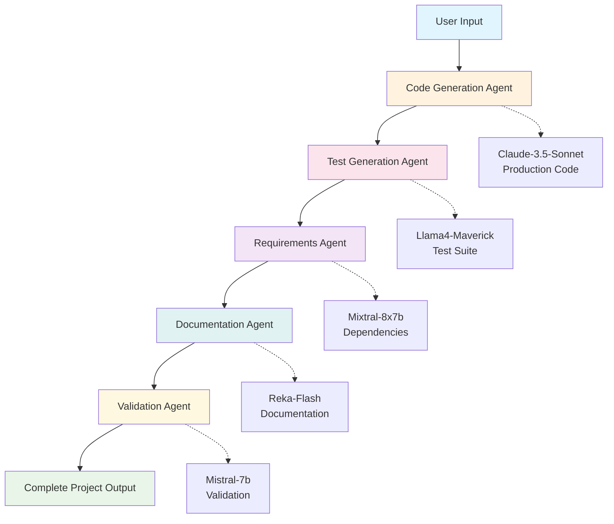

# Code Generation Agent - Prompt Chaining Patterns with Snowflake Cortex

THis code repository is created as part of DAMG 7374 Gen AI w/ LLM Fall 2025 semester -  Lab session 

A Streamlit application demonstrating prompt chaining and agentic patterns using multiple specialized AI models through Snowflake Cortex. 

## Overview

This application creates a complete software development workflow using 5 specialized AI agents:

1. **Code Generation Agent** (Claude-3.5-Sonnet) - Generates production-ready Python code
2. **Test Generation Agent** (Llama4-Maverick) - Creates comprehensive test suites  
3. **Requirements Agent** (Mixtral-8x7b) - Analyzes dependencies and versions
4. **Documentation Agent** (Reka-Flash) - Writes professional README files
5. **Validation Agent** (Mistral-7b) - Reviews and validates the complete project

## Project Structure

```
project/
├── app.py                    # Main Streamlit application
├── agent_chain.py            # Orchestrates agent execution sequence
├── agents.py                 # Individual agent classes with model assignments
├── agent_prompts.py          # Specialized prompts for each agent
├── snowflake_connection.py   # Handles Snowflake Cortex API calls
├── requirements.txt          # Python dependencies
├── .env                      # Snowflake credentials (create this)
└── README.md                 # This file
```


## Setup Instructions

### 1. Clone and Install Dependencies

```bash
# Install required packages
pip install -r requirements.txt
```

### 2. Configure Snowflake Authentication

Create a `.env` file in the project root:

```bash
# .env file
SNOWFLAKE_USER=your_username
SNOWFLAKE_PASSWORD=your_pat_token_here
SNOWFLAKE_ACCOUNT=your_account_identifier  
SNOWFLAKE_WAREHOUSE=COMPUTE_WH
SNOWFLAKE_DATABASE=your_database
SNOWFLAKE_SCHEMA=PUBLIC
```

**Getting Your PAT Token:**
1. Login to Snowflake web interface
2. Go to your profile → "My Profile" → "Tokens" tab
3. Click "Generate Token" 
4. Set expiration (recommend 90+ days for development)
5. Copy the token and use as your password in `.env`

### 3. Verify Snowflake Access

Ensure your Snowflake account has access to these Cortex models:
- `claude-3-5-sonnet`
- `llama4-maverick` 
- `mixtral-8x7b`
- `reka-flash`
- `mistral-7b`

### 4. Run the Application

```bash
streamlit run app.py
```

The application will open in your browser at `http://localhost:8501`

## Architecture

### System Flow Diagram



### Agent Specialization

Each agent uses a different model optimized for its specific task:

| Agent | Model | Specialization | Output |
|-------|-------|----------------|--------|
| Code Generation | Claude-3.5-Sonnet | Complex reasoning, code structure | Python script with proper architecture |
| Test Generation | Llama4-Maverick | Analysis, edge case identification | Pytest test suite with high coverage |
| Requirements | Mixtral-8x7b | Dependency analysis, versioning | requirements.txt with accurate packages |
| Documentation | Reka-Flash | Technical writing, clarity | Professional README with examples |
| Validation | Mistral-7b | Code review, quality assessment | Structured project evaluation |

